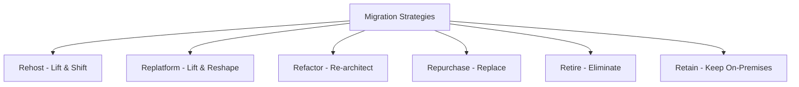

# Cloud Migration Strategy: A Complete Guide to Successful Migration

Cloud migration has become a critical initiative for organizations seeking to modernize their infrastructure, reduce costs, and accelerate innovation. However, successful cloud migration requires careful planning, strategic thinking, and systematic execution. This comprehensive guide will walk you through proven strategies for migrating to the cloud successfully.

## Understanding Cloud Migration

Cloud migration is the process of moving digital assets, services, databases, IT resources, and applications either partially or wholly into the cloud. It's not just about moving existing systems—it's about transforming how your organization operates and delivers value.

### Types of Cloud Migration



## The 6 R's of Cloud Migration

### 1. Rehost (Lift and Shift)

Moving applications to the cloud without modifications.

```yaml
# Example: VM migration to AWS EC2
migration_plan:
  strategy: rehost
  source:
    environment: on-premises
    servers:
      - web-server-01: 
          os: Windows Server 2019
          cpu: 4 cores
          memory: 16GB
          storage: 500GB
      - db-server-01:
          os: Linux RHEL 8
          cpu: 8 cores
          memory: 32GB
          storage: 1TB
  
  target:
    cloud_provider: AWS
    instances:
      - web-server-01:
          instance_type: t3.large
          ami: ami-0abcdef1234567890
          storage: 500GB EBS
      - db-server-01:
          instance_type: r5.2xlarge
          ami: ami-0fedcba0987654321
          storage: 1TB EBS
  
  timeline: 2-4 weeks
  complexity: low
  cost_optimization: minimal
```

**Benefits:**
- Fastest migration approach
- Minimal application changes
- Quick time-to-cloud

**Considerations:**
- Limited cloud-native benefits
- May not optimize costs immediately
- Technical debt carried forward

### 2. Replatform (Lift and Reshape)

Making minimal changes to optimize for cloud.

```javascript
// Example: Database migration to managed service
class DatabaseMigration {
  constructor() {
    this.sourceDB = new MySQLDatabase({
      host: 'on-premises-server',
      port: 3306,
      database: 'production'
    });
    
    this.targetDB = new AWSRDSMySQL({
      endpoint: 'prod-db.cluster-xyz.us-east-1.rds.amazonaws.com',
      port: 3306,
      database: 'production',
      multiAZ: true,
      backupRetention: 7,
      encryption: true
    });
  }
  
  async migrate() {
    // 1. Create RDS instance with similar configuration
    await this.createRDSInstance();
    
    // 2. Set up replication
    await this.setupReplication();
    
    // 3. Sync data
    await this.syncData();
    
    // 4. Update application configuration
    await this.updateAppConfig();
    
    // 5. Cutover
    await this.performCutover();
  }
  
  async createRDSInstance() {
    const config = {
      dbInstanceIdentifier: 'production-mysql',
      dbInstanceClass: 'db.r5.2xlarge',
      engine: 'mysql',
      engineVersion: '8.0.28',
      allocatedStorage: 1000,
      storageType: 'gp2',
      multiAZ: true,
      vpcSecurityGroupIds: ['sg-12345678'],
      dbSubnetGroupName: 'production-subnet-group'
    };
    
    return await this.rds.createDBInstance(config);
  }
}
```

### 3. Refactor (Re-architect)

Redesigning applications to be cloud-native.

```javascript
// Example: Monolith to microservices refactoring
class MonolithRefactoring {
  constructor() {
    this.services = new Map();
    this.apiGateway = new APIGateway();
    this.serviceDiscovery = new ServiceDiscovery();
  }
  
  // Break monolith into microservices
  async refactorToMicroservices() {
    // 1. Identify service boundaries
    const serviceBoundaries = await this.analyzeMonolith();
    
    // 2. Extract services gradually
    for (const boundary of serviceBoundaries) {
      await this.extractService(boundary);
    }
    
    // 3. Implement service communication
    await this.setupServiceCommunication();
    
    // 4. Migrate data
    await this.migrateData();
  }
  
  async extractService(boundary) {
    const service = {
      name: boundary.name,
      endpoints: boundary.endpoints,
      database: boundary.database,
      dependencies: boundary.dependencies
    };
    
    // Create containerized service
    const container = await this.containerizeService(service);
    
    // Deploy to Kubernetes
    await this.deployToK8s(container);
    
    // Register with service discovery
    await this.serviceDiscovery.register(service);
    
    this.services.set(service.name, service);
  }
  
  async containerizeService(service) {
    const dockerfile = `
      FROM node:18-alpine
      WORKDIR /app
      COPY package*.json ./
      RUN npm ci --only=production
      COPY . .
      EXPOSE ${service.port}
      CMD ["npm", "start"]
    `;
    
    return await this.buildContainer(dockerfile, service);
  }
}
```

## Migration Planning Framework

### 1. Assessment and Discovery

**Infrastructure Assessment**
```python
# Automated discovery script
import boto3
import json
from datetime import datetime

class InfrastructureAssessment:
    def __init__(self):
        self.ec2 = boto3.client('ec2')
        self.rds = boto3.client('rds')
        self.assessment_data = {}
    
    def discover_infrastructure(self):
        """Discover existing infrastructure"""
        
        # Discover compute resources
        instances = self.ec2.describe_instances()
        self.assessment_data['compute'] = self.analyze_instances(instances)
        
        # Discover databases
        databases = self.rds.describe_db_instances()
        self.assessment_data['databases'] = self.analyze_databases(databases)
        
        # Discover storage
        volumes = self.ec2.describe_volumes()
        self.assessment_data['storage'] = self.analyze_storage(volumes)
        
        return self.assessment_data
    
    def analyze_instances(self, instances):
        """Analyze EC2 instances for migration planning"""
        analysis = []
        
        for reservation in instances['Reservations']:
            for instance in reservation['Instances']:
                instance_analysis = {
                    'instance_id': instance['InstanceId'],
                    'instance_type': instance['InstanceType'],
                    'state': instance['State']['Name'],
                    'cpu_utilization': self.get_cpu_metrics(instance['InstanceId']),
                    'memory_utilization': self.get_memory_metrics(instance['InstanceId']),
                    'network_utilization': self.get_network_metrics(instance['InstanceId']),
                    'migration_recommendation': self.recommend_migration_strategy(instance)
                }
                analysis.append(instance_analysis)
        
        return analysis
    
    def recommend_migration_strategy(self, instance):
        """Recommend migration strategy based on instance characteristics"""
        
        # Simple recommendation logic
        if instance['InstanceType'].startswith('t2'):
            return {
                'strategy': 'rehost',
                'target_instance': 't3.' + instance['InstanceType'].split('.')[1],
                'expected_savings': '20-30%'
            }
        elif instance['State']['Name'] == 'stopped':
            return {
                'strategy': 'retire',
                'reason': 'Instance appears unused',
                'expected_savings': '100%'
            }
        else:
            return {
                'strategy': 'replatform',
                'recommendations': ['Consider managed services', 'Optimize instance size']
            }
```

**Application Dependency Mapping**
```javascript
// Application dependency discovery
class DependencyMapper {
  constructor() {
    this.dependencies = new Map();
    this.applications = new Map();
  }
  
  async mapDependencies() {
    const applications = await this.discoverApplications();
    
    for (const app of applications) {
      const dependencies = await this.analyzeDependencies(app);
      this.dependencies.set(app.id, dependencies);
    }
    
    return this.buildDependencyGraph();
  }
  
  async analyzeDependencies(application) {
    const dependencies = {
      databases: await this.findDatabaseConnections(application),
      services: await this.findServiceCalls(application),
      files: await this.findFileSystemDependencies(application),
      network: await this.findNetworkDependencies(application)
    };
    
    return dependencies;
  }
  
  buildDependencyGraph() {
    const graph = {
      nodes: [],
      edges: []
    };
    
    // Add application nodes
    for (const [appId, app] of this.applications) {
      graph.nodes.push({
        id: appId,
        type: 'application',
        name: app.name,
        criticality: app.criticality
      });
    }
    
    // Add dependency edges
    for (const [appId, deps] of this.dependencies) {
      deps.services.forEach(service => {
        graph.edges.push({
          source: appId,
          target: service.id,
          type: 'service_call',
          protocol: service.protocol
        });
      });
    }
    
    return graph;
  }
}
```

### 2. Migration Wave Planning

**Wave Strategy**
```yaml
# Migration wave planning
migration_waves:
  wave_1:
    name: "Low Risk Applications"
    duration: "4 weeks"
    applications:
      - static_websites
      - development_environments
      - non_critical_tools
    strategy: "rehost"
    success_criteria:
      - zero_downtime: true
      - performance_maintained: true
      - cost_neutral: true
  
  wave_2:
    name: "Moderate Complexity Applications"
    duration: "8 weeks"
    applications:
      - internal_applications
      - reporting_systems
      - batch_processing
    strategy: "replatform"
    success_criteria:
      - minimal_downtime: "< 4 hours"
      - performance_improved: "20%"
      - cost_reduction: "15%"
  
  wave_3:
    name: "Critical Business Applications"
    duration: "12 weeks"
    applications:
      - customer_facing_apps
      - core_business_systems
      - high_availability_services
    strategy: "refactor"
    success_criteria:
      - zero_downtime: true
      - performance_improved: "50%"
      - cost_reduction: "30%"
      - scalability_improved: true
```

## Implementation Strategies

### 1. Hybrid Cloud Approach

```javascript
// Hybrid cloud management
class HybridCloudManager {
  constructor() {
    this.onPremises = new OnPremisesInfrastructure();
    this.cloudProviders = {
      aws: new AWSProvider(),
      azure: new AzureProvider(),
      gcp: new GCPProvider()
    };
    this.networkConnections = new Map();
  }
  
  async setupHybridConnectivity() {
    // Establish VPN connections
    const vpnConnections = await this.setupVPNConnections();
    
    // Configure direct connections (AWS Direct Connect, Azure ExpressRoute)
    const directConnections = await this.setupDirectConnections();
    
    // Set up hybrid DNS
    await this.configureHybridDNS();
    
    // Configure identity federation
    await this.setupIdentityFederation();
    
    return {
      vpnConnections,
      directConnections,
      status: 'connected'
    };
  }
  
  async migrateWorkload(workload, targetCloud) {
    // Pre-migration validation
    await this.validateMigrationReadiness(workload);
    
    // Create cloud resources
    const cloudResources = await this.provisionCloudResources(workload, targetCloud);
    
    // Sync data
    await this.syncData(workload, cloudResources);
    
    // Test connectivity
    await this.testConnectivity(workload, cloudResources);
    
    // Perform cutover
    await this.performCutover(workload, cloudResources);
    
    return cloudResources;
  }
}
```

### 2. Data Migration Strategies

**Database Migration**
```sql
-- Database migration with minimal downtime
-- Step 1: Set up replication
CREATE REPLICA DATABASE cloud_replica 
FROM on_premises_primary
WITH (
    SYNC_MODE = 'ASYNC',
    COMPRESSION = 'ENABLED',
    ENCRYPTION = 'ENABLED'
);

-- Step 2: Monitor replication lag
SELECT 
    replica_name,
    lag_seconds,
    last_sync_time
FROM replication_status
WHERE replica_name = 'cloud_replica';

-- Step 3: Perform cutover when lag is minimal
BEGIN TRANSACTION;
    -- Stop application writes
    UPDATE application_config 
    SET maintenance_mode = TRUE;
    
    -- Wait for replication to catch up
    WAITFOR DELAY '00:00:30';
    
    -- Promote replica to primary
    ALTER DATABASE cloud_replica 
    SET ROLE = 'PRIMARY';
    
    -- Update application configuration
    UPDATE application_config 
    SET database_endpoint = 'cloud_replica_endpoint',
        maintenance_mode = FALSE;
COMMIT;
```

**Large-Scale Data Transfer**
```python
# AWS DataSync for large data transfers
import boto3
from concurrent.futures import ThreadPoolExecutor
import hashlib

class DataMigrationManager:
    def __init__(self):
        self.datasync = boto3.client('datasync')
        self.s3 = boto3.client('s3')
        
    def create_migration_task(self, source_location, destination_location):
        """Create DataSync task for large data migration"""
        
        task_config = {
            'SourceLocationArn': source_location,
            'DestinationLocationArn': destination_location,
            'Options': {
                'VerifyMode': 'POINT_IN_TIME_CONSISTENT',
                'OverwriteMode': 'ALWAYS',
                'Atime': 'BEST_EFFORT',
                'Mtime': 'PRESERVE',
                'Uid': 'INT_VALUE',
                'Gid': 'INT_VALUE',
                'PreserveDeletedFiles': 'PRESERVE',
                'PreserveDevices': 'NONE',
                'PosixPermissions': 'PRESERVE',
                'BytesPerSecond': 104857600,  # 100 MB/s
                'TaskQueueing': 'ENABLED'
            },
            'Excludes': [
                {
                    'FilterType': 'SIMPLE_PATTERN',
                    'Value': '*.tmp'
                },
                {
                    'FilterType': 'SIMPLE_PATTERN', 
                    'Value': '*.log'
                }
            ]
        }
        
        response = self.datasync.create_task(**task_config)
        return response['TaskArn']
    
    def monitor_migration_progress(self, task_arn):
        """Monitor data migration progress"""
        
        while True:
            execution = self.datasync.describe_task_execution(
                TaskExecutionArn=task_arn
            )
            
            status = execution['Status']
            
            if status == 'SUCCESS':
                return {
                    'status': 'completed',
                    'bytes_transferred': execution['BytesTransferred'],
                    'duration': execution['Result']['TotalDuration']
                }
            elif status == 'ERROR':
                return {
                    'status': 'failed',
                    'error': execution['Result']['ErrorDetail']
                }
            
            # Wait before checking again
            time.sleep(30)
```

### 3. Application Migration Patterns

**Blue-Green Deployment**
```yaml
# Blue-Green deployment for zero-downtime migration
apiVersion: v1
kind: Service
metadata:
  name: application-service
spec:
  selector:
    app: application
    version: blue  # Initially pointing to blue environment
  ports:
    - port: 80
      targetPort: 8080

---
# Blue environment (current production)
apiVersion: apps/v1
kind: Deployment
metadata:
  name: application-blue
spec:
  replicas: 3
  selector:
    matchLabels:
      app: application
      version: blue
  template:
    metadata:
      labels:
        app: application
        version: blue
    spec:
      containers:
      - name: application
        image: myapp:v1.0
        ports:
        - containerPort: 8080

---
# Green environment (new version)
apiVersion: apps/v1
kind: Deployment
metadata:
  name: application-green
spec:
  replicas: 3
  selector:
    matchLabels:
      app: application
      version: green
  template:
    metadata:
      labels:
        app: application
        version: green
    spec:
      containers:
      - name: application
        image: myapp:v2.0
        ports:
        - containerPort: 8080
```

**Canary Deployment**
```javascript
// Canary deployment controller
class CanaryDeployment {
  constructor() {
    this.k8s = new KubernetesClient();
    this.monitoring = new MonitoringClient();
  }
  
  async deployCanary(application, newVersion, canaryPercentage = 10) {
    // Deploy canary version
    await this.deployCanaryVersion(application, newVersion, canaryPercentage);
    
    // Monitor metrics
    const metrics = await this.monitorCanaryMetrics(application, '5m');
    
    // Decide on promotion based on metrics
    if (this.shouldPromoteCanary(metrics)) {
      await this.promoteCanary(application, newVersion);
    } else {
      await this.rollbackCanary(application);
    }
  }
  
  shouldPromoteCanary(metrics) {
    const thresholds = {
      errorRate: 0.01,      // 1% error rate
      latencyP99: 1000,     // 1 second
      successRate: 0.99     // 99% success rate
    };
    
    return (
      metrics.errorRate < thresholds.errorRate &&
      metrics.latencyP99 < thresholds.latencyP99 &&
      metrics.successRate > thresholds.successRate
    );
  }
  
  async promoteCanary(application, newVersion) {
    // Gradually increase canary traffic
    const stages = [25, 50, 75, 100];
    
    for (const percentage of stages) {
      await this.updateTrafficSplit(application, newVersion, percentage);
      await this.waitAndMonitor('2m');
      
      const metrics = await this.monitorCanaryMetrics(application, '2m');
      if (!this.shouldPromoteCanary(metrics)) {
        await this.rollbackCanary(application);
        throw new Error('Canary promotion failed at ' + percentage + '%');
      }
    }
    
    // Complete promotion
    await this.completePromotion(application, newVersion);
  }
}
```

## Risk Management and Mitigation

### 1. Migration Risk Assessment

```javascript
// Risk assessment framework
class MigrationRiskAssessment {
  constructor() {
    this.riskFactors = {
      technical: new TechnicalRiskAssessment(),
      business: new BusinessRiskAssessment(),
      security: new SecurityRiskAssessment(),
      compliance: new ComplianceRiskAssessment()
    };
  }
  
  assessMigrationRisk(application) {
    const risks = {};
    
    // Technical risks
    risks.technical = this.riskFactors.technical.assess({
      complexity: application.complexity,
      dependencies: application.dependencies,
      dataSize: application.dataSize,
      customizations: application.customizations
    });
    
    // Business risks
    risks.business = this.riskFactors.business.assess({
      criticality: application.criticality,
      userBase: application.userBase,
      revenue_impact: application.revenueImpact,
      sla_requirements: application.slaRequirements
    });
    
    // Security risks
    risks.security = this.riskFactors.security.assess({
      data_sensitivity: application.dataSensitivity,
      compliance_requirements: application.complianceRequirements,
      access_controls: application.accessControls
    });
    
    return this.calculateOverallRisk(risks);
  }
  
  calculateOverallRisk(risks) {
    const weights = {
      technical: 0.3,
      business: 0.4,
      security: 0.3
    };
    
    const weightedScore = Object.entries(risks).reduce((total, [category, risk]) => {
      return total + (risk.score * weights[category]);
    }, 0);
    
    return {
      overall_score: weightedScore,
      risk_level: this.getRiskLevel(weightedScore),
      mitigation_strategies: this.getMitigationStrategies(risks),
      recommended_approach: this.getRecommendedApproach(weightedScore)
    };
  }
}
```

### 2. Rollback Strategies

```yaml
# Automated rollback procedures
rollback_procedures:
  database_rollback:
    triggers:
      - performance_degradation: "> 50%"
      - error_rate: "> 5%"
      - data_corruption: "detected"
    
    steps:
      - name: "Stop application traffic"
        action: "update_load_balancer"
        target: "maintenance_page"
      
      - name: "Restore database"
        action: "restore_from_backup"
        backup_point: "pre_migration_snapshot"
      
      - name: "Verify data integrity"
        action: "run_data_validation"
        
      - name: "Resume application traffic"
        action: "update_load_balancer"
        target: "restored_application"
  
  application_rollback:
    triggers:
      - deployment_failure: "detected"
      - health_check_failure: "> 3 consecutive"
      - user_reported_issues: "> threshold"
    
    steps:
      - name: "Switch to previous version"
        action: "update_service_selector"
        target: "previous_deployment"
      
      - name: "Scale down failed deployment"
        action: "scale_deployment"
        replicas: 0
      
      - name: "Verify rollback success"
        action: "run_smoke_tests"
```

## Cost Optimization During Migration

### 1. Right-Sizing Resources

```python
# Automated right-sizing recommendations
class ResourceOptimizer:
    def __init__(self):
        self.cloudwatch = boto3.client('cloudwatch')
        self.ec2 = boto3.client('ec2')
        
    def analyze_instance_utilization(self, instance_id, days=30):
        """Analyze instance utilization over specified period"""
        
        end_time = datetime.utcnow()
        start_time = end_time - timedelta(days=days)
        
        metrics = {
            'CPUUtilization': self.get_metric_statistics(
                instance_id, 'CPUUtilization', start_time, end_time
            ),
            'NetworkIn': self.get_metric_statistics(
                instance_id, 'NetworkIn', start_time, end_time
            ),
            'NetworkOut': self.get_metric_statistics(
                instance_id, 'NetworkOut', start_time, end_time
            )
        }
        
        return self.generate_rightsizing_recommendation(instance_id, metrics)
    
    def generate_rightsizing_recommendation(self, instance_id, metrics):
        """Generate right-sizing recommendation based on utilization"""
        
        avg_cpu = metrics['CPUUtilization']['Average']
        max_cpu = metrics['CPUUtilization']['Maximum']
        
        current_instance = self.ec2.describe_instances(
            InstanceIds=[instance_id]
        )['Reservations'][0]['Instances'][0]
        
        current_type = current_instance['InstanceType']
        
        if avg_cpu < 20 and max_cpu < 40:
            recommendation = self.get_smaller_instance_type(current_type)
            potential_savings = self.calculate_savings(current_type, recommendation)
            
            return {
                'action': 'downsize',
                'current_type': current_type,
                'recommended_type': recommendation,
                'potential_monthly_savings': potential_savings,
                'confidence': 'high' if avg_cpu < 10 else 'medium'
            }
        elif avg_cpu > 80 or max_cpu > 90:
            recommendation = self.get_larger_instance_type(current_type)
            
            return {
                'action': 'upsize',
                'current_type': current_type,
                'recommended_type': recommendation,
                'reason': 'high_utilization',
                'confidence': 'high'
            }
        else:
            return {
                'action': 'no_change',
                'current_type': current_type,
                'reason': 'optimal_utilization'
            }
```

### 2. Reserved Instance Planning

```javascript
// Reserved Instance optimization
class ReservedInstanceOptimizer {
  constructor() {
    this.ec2 = new AWS.EC2();
    this.costExplorer = new AWS.CostExplorer();
  }
  
  async analyzeRIOpportunities() {
    // Get current instance usage
    const usage = await this.getCurrentUsage();
    
    // Analyze usage patterns
    const patterns = await this.analyzeUsagePatterns(usage);
    
    // Generate RI recommendations
    const recommendations = await this.generateRIRecommendations(patterns);
    
    return recommendations;
  }
  
  async generateRIRecommendations(patterns) {
    const recommendations = [];
    
    for (const [instanceType, usage] of patterns) {
      if (usage.consistentUsage > 0.7) { // 70% consistent usage
        const riRecommendation = {
          instanceType,
          term: usage.averageRuntime > 8760 ? '3-year' : '1-year', // hours in a year
          paymentOption: 'partial-upfront',
          quantity: Math.floor(usage.averageInstances),
          estimatedSavings: await this.calculateRISavings(instanceType, usage)
        };
        
        recommendations.push(riRecommendation);
      }
    }
    
    return recommendations.sort((a, b) => b.estimatedSavings - a.estimatedSavings);
  }
  
  async calculateRISavings(instanceType, usage) {
    const onDemandCost = usage.averageInstances * usage.averageRuntime * 
                        this.getOnDemandPrice(instanceType);
    
    const riCost = usage.averageInstances * 
                  this.getRIPrice(instanceType, '1-year', 'partial-upfront');
    
    return onDemandCost - riCost;
  }
}
```

## Monitoring and Validation

### 1. Migration Monitoring Dashboard

```javascript
// Real-time migration monitoring
class MigrationMonitor {
  constructor() {
    this.metrics = new MetricsCollector();
    this.alerts = new AlertManager();
    this.dashboard = new DashboardManager();
  }
  
  async setupMigrationMonitoring(migrationId) {
    // Set up custom metrics
    await this.metrics.createCustomMetrics([
      'migration.progress.percentage',
      'migration.data.transferred.bytes',
      'migration.errors.count',
      'migration.performance.latency',
      'migration.availability.percentage'
    ]);
    
    // Configure alerts
    await this.alerts.createAlerts([
      {
        name: 'Migration Error Rate High',
        condition: 'migration.errors.count > 10',
        action: 'notify_team'
      },
      {
        name: 'Migration Performance Degraded',
        condition: 'migration.performance.latency > 2000ms',
        action: 'escalate'
      }
    ]);
    
    // Create dashboard
    await this.dashboard.createMigrationDashboard(migrationId);
  }
  
  async trackMigrationProgress(migrationId) {
    const metrics = {
      timestamp: new Date(),
      migrationId,
      progress: await this.calculateProgress(migrationId),
      performance: await this.measurePerformance(migrationId),
      errors: await this.getErrorCount(migrationId),
      availability: await this.checkAvailability(migrationId)
    };
    
    await this.metrics.publish(metrics);
    
    // Check for issues
    if (metrics.errors > 5) {
      await this.alerts.trigger('high_error_rate', metrics);
    }
    
    return metrics;
  }
}
```

### 2. Post-Migration Validation

```python
# Comprehensive post-migration validation
class PostMigrationValidator:
    def __init__(self):
        self.test_suites = {
            'functional': FunctionalTestSuite(),
            'performance': PerformanceTestSuite(),
            'security': SecurityTestSuite(),
            'data_integrity': DataIntegrityTestSuite()
        }
    
    def validate_migration(self, application):
        """Run comprehensive validation tests"""
        
        results = {}
        
        # Functional validation
        results['functional'] = self.test_suites['functional'].run_tests(application)
        
        # Performance validation
        results['performance'] = self.test_suites['performance'].run_tests(application)
        
        # Security validation
        results['security'] = self.test_suites['security'].run_tests(application)
        
        # Data integrity validation
        results['data_integrity'] = self.test_suites['data_integrity'].run_tests(application)
        
        # Generate validation report
        return self.generate_validation_report(results)
    
    def generate_validation_report(self, results):
        """Generate comprehensive validation report"""
        
        total_tests = sum(len(suite_results['tests']) for suite_results in results.values())
        passed_tests = sum(len([t for t in suite_results['tests'] if t['status'] == 'passed']) 
                          for suite_results in results.values())
        
        success_rate = (passed_tests / total_tests) * 100
        
        report = {
            'summary': {
                'total_tests': total_tests,
                'passed_tests': passed_tests,
                'success_rate': success_rate,
                'migration_status': 'successful' if success_rate >= 95 else 'needs_attention'
            },
            'detailed_results': results,
            'recommendations': self.generate_recommendations(results)
        }
        
        return report
```

## Conclusion

Successful cloud migration requires careful planning, systematic execution, and continuous monitoring. The strategies outlined in this guide provide a comprehensive framework for migrating to the cloud while minimizing risks and maximizing benefits.

**Key Success Factors:**

1. **Thorough Assessment** - Understand your current environment and dependencies
2. **Strategic Planning** - Choose the right migration strategy for each workload
3. **Phased Approach** - Migrate in waves to reduce risk and learn from experience
4. **Automation** - Use tools and automation to ensure consistency and reduce errors
5. **Monitoring** - Implement comprehensive monitoring throughout the migration process
6. **Validation** - Thoroughly test and validate each migration before declaring success

**Expected Outcomes:**

- **Cost Reduction**: 20-50% reduction in infrastructure costs
- **Performance Improvement**: 30-60% improvement in application performance
- **Scalability**: Ability to scale resources up or down based on demand
- **Reliability**: Improved uptime and disaster recovery capabilities
- **Innovation**: Faster deployment of new features and services

**Common Pitfalls to Avoid:**

- Insufficient planning and assessment
- Underestimating complexity and dependencies
- Lack of proper testing and validation
- Inadequate monitoring and rollback procedures
- Poor communication and change management

Remember, cloud migration is not just a technical project—it's a business transformation that requires alignment across technology, operations, and business teams. Success depends on careful planning, systematic execution, and continuous optimization.

---

*Ready to plan your cloud migration strategy? Our cloud engineering experts can help you assess, plan, and execute a successful migration to the cloud. [Contact us](/contact) to get started.*