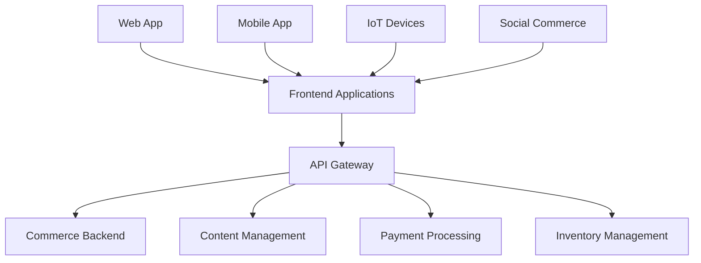

# Headless Commerce Architecture: The Future of E-commerce Flexibility

The e-commerce landscape is evolving rapidly, and traditional monolithic platforms are struggling to keep pace with modern demands for speed, flexibility, and omnichannel experiences. Enter headless commerce—an architectural approach that's revolutionizing how we build and scale e-commerce solutions.

## What is Headless Commerce?

Headless commerce separates the frontend presentation layer (the "head") from the backend commerce functionality. This decoupled architecture allows developers to:

- **Use any frontend technology** (React, Vue, Angular, mobile apps)
- **Deliver content across multiple channels** (web, mobile, IoT, social commerce)
- **Scale frontend and backend independently**
- **Iterate faster** without backend constraints



## Traditional vs. Headless Commerce

### Traditional Monolithic Commerce

```javascript
// Traditional tightly-coupled architecture
class MonolithicEcommerce {
  constructor() {
    this.frontend = new TemplateEngine();
    this.backend = new CommerceEngine();
    this.database = new Database();
    
    // Everything is interconnected
    this.frontend.dependsOn(this.backend);
    this.backend.dependsOn(this.database);
  }
  
  // Limited customization options
  renderProductPage(productId) {
    const product = this.backend.getProduct(productId);
    return this.frontend.renderTemplate('product', product);
  }
}
```

### Headless Commerce Architecture

```javascript
// Headless decoupled architecture
class HeadlessCommerce {
  constructor() {
    this.api = new CommerceAPI();
    this.frontends = new Map();
  }
  
  // Multiple frontend options
  registerFrontend(name, frontend) {
    this.frontends.set(name, frontend);
  }
  
  // API-first approach
  async getProduct(productId) {
    return await this.api.get(`/products/${productId}`);
  }
  
  async getCart(sessionId) {
    return await this.api.get(`/cart/${sessionId}`);
  }
  
  async processOrder(orderData) {
    return await this.api.post('/orders', orderData);
  }
}

// Frontend implementations
const webFrontend = new ReactCommerceFrontend();
const mobileFrontend = new ReactNativeFrontend();
const voiceFrontend = new AlexaSkillFrontend();

const commerce = new HeadlessCommerce();
commerce.registerFrontend('web', webFrontend);
commerce.registerFrontend('mobile', mobileFrontend);
commerce.registerFrontend('voice', voiceFrontend);
```

## Core Components of Headless Commerce

### 1. Commerce API Layer

The API layer serves as the central nervous system, exposing commerce functionality through RESTful or GraphQL APIs.

```javascript
// Commerce API implementation
class CommerceAPI {
  constructor() {
    this.router = express.Router();
    this.setupRoutes();
  }
  
  setupRoutes() {
    // Product catalog
    this.router.get('/products', this.getProducts.bind(this));
    this.router.get('/products/:id', this.getProduct.bind(this));
    this.router.get('/categories', this.getCategories.bind(this));
    
    // Shopping cart
    this.router.post('/cart/add', this.addToCart.bind(this));
    this.router.put('/cart/update', this.updateCart.bind(this));
    this.router.delete('/cart/remove/:itemId', this.removeFromCart.bind(this));
    
    // Checkout and orders
    this.router.post('/checkout', this.processCheckout.bind(this));
    this.router.get('/orders/:id', this.getOrder.bind(this));
    
    // Customer management
    this.router.post('/customers', this.createCustomer.bind(this));
    this.router.get('/customers/:id', this.getCustomer.bind(this));
  }
  
  async getProducts(req, res) {
    try {
      const { page = 1, limit = 20, category, search } = req.query;
      
      const filters = {};
      if (category) filters.category = category;
      if (search) filters.search = search;
      
      const products = await productService.findMany({
        ...filters,
        page: parseInt(page),
        limit: parseInt(limit)
      });
      
      res.json({
        products: products.items,
        pagination: {
          page: products.page,
          totalPages: products.totalPages,
          totalItems: products.totalItems
        }
      });
    } catch (error) {
      res.status(500).json({ error: error.message });
    }
  }
  
  async addToCart(req, res) {
    try {
      const { productId, quantity, sessionId } = req.body;
      
      const product = await productService.findById(productId);
      if (!product) {
        return res.status(404).json({ error: 'Product not found' });
      }
      
      const cartItem = await cartService.addItem({
        sessionId,
        productId,
        quantity,
        price: product.price
      });
      
      const cart = await cartService.getCart(sessionId);
      
      res.json({
        item: cartItem,
        cart: cart,
        message: 'Item added to cart successfully'
      });
    } catch (error) {
      res.status(500).json({ error: error.message });
    }
  }
}
```

### 2. GraphQL for Flexible Data Fetching

GraphQL provides more flexibility than REST APIs, allowing frontends to request exactly the data they need.

```graphql
# GraphQL schema for commerce
type Product {
  id: ID!
  name: String!
  description: String
  price: Float!
  images: [ProductImage!]!
  variants: [ProductVariant!]!
  category: Category!
  inventory: Inventory!
  reviews: ReviewConnection
}

type ProductVariant {
  id: ID!
  name: String!
  price: Float!
  sku: String!
  inventory: Int!
  attributes: [VariantAttribute!]!
}

type Cart {
  id: ID!
  items: [CartItem!]!
  subtotal: Float!
  tax: Float!
  shipping: Float!
  total: Float!
}

type Query {
  product(id: ID!): Product
  products(
    first: Int
    after: String
    category: String
    search: String
  ): ProductConnection!
  
  cart(sessionId: String!): Cart
  categories: [Category!]!
}

type Mutation {
  addToCart(
    sessionId: String!
    productId: ID!
    variantId: ID
    quantity: Int!
  ): CartItem!
  
  updateCartItem(
    itemId: ID!
    quantity: Int!
  ): CartItem!
  
  removeFromCart(itemId: ID!): Boolean!
  
  createOrder(input: OrderInput!): Order!
}
```

```javascript
// GraphQL resolvers
const resolvers = {
  Query: {
    product: async (_, { id }) => {
      return await productService.findById(id);
    },
    
    products: async (_, { first, after, category, search }) => {
      return await productService.findMany({
        limit: first,
        cursor: after,
        category,
        search
      });
    },
    
    cart: async (_, { sessionId }) => {
      return await cartService.getCart(sessionId);
    }
  },
  
  Mutation: {
    addToCart: async (_, { sessionId, productId, variantId, quantity }) => {
      const product = await productService.findById(productId);
      const variant = variantId ? 
        await productService.findVariant(variantId) : null;
      
      return await cartService.addItem({
        sessionId,
        productId,
        variantId,
        quantity,
        price: variant?.price || product.price
      });
    }
  },
  
  Product: {
    reviews: async (product) => {
      return await reviewService.findByProduct(product.id);
    },
    
    inventory: async (product) => {
      return await inventoryService.getStock(product.id);
    }
  }
};
```

### 3. Frontend Implementation Examples

**React/Next.js Frontend**

```javascript
// React commerce components
import { useQuery, useMutation } from '@apollo/client';
import { GET_PRODUCT, ADD_TO_CART } from '../graphql/queries';

const ProductPage = ({ productId }) => {
  const { data, loading, error } = useQuery(GET_PRODUCT, {
    variables: { id: productId }
  });
  
  const [addToCart, { loading: addingToCart }] = useMutation(ADD_TO_CART);
  
  const handleAddToCart = async (variantId, quantity) => {
    try {
      await addToCart({
        variables: {
          sessionId: getSessionId(),
          productId,
          variantId,
          quantity
        }
      });
      
      // Show success message
      toast.success('Added to cart!');
    } catch (error) {
      toast.error('Failed to add to cart');
    }
  };
  
  if (loading) return <ProductSkeleton />;
  if (error) return <ErrorMessage error={error} />;
  
  const { product } = data;
  
  return (
    <div className="product-page">
      <ProductGallery images={product.images} />
      
      <div className="product-info">
        <h1>{product.name}</h1>
        <p className="price">${product.price}</p>
        <p className="description">{product.description}</p>
        
        <VariantSelector 
          variants={product.variants}
          onSelect={(variant) => setSelectedVariant(variant)}
        />
        
        <AddToCartButton
          onClick={() => handleAddToCart(selectedVariant?.id, 1)}
          loading={addingToCart}
          disabled={!product.inventory.inStock}
        >
          {product.inventory.inStock ? 'Add to Cart' : 'Out of Stock'}
        </AddToCartButton>
      </div>
    </div>
  );
};

// Reusable commerce hooks
const useCart = () => {
  const [cart, setCart] = useState(null);
  
  const addItem = async (productId, quantity) => {
    const response = await fetch('/api/cart/add', {
      method: 'POST',
      headers: { 'Content-Type': 'application/json' },
      body: JSON.stringify({ productId, quantity, sessionId: getSessionId() })
    });
    
    const result = await response.json();
    setCart(result.cart);
    return result;
  };
  
  const updateItem = async (itemId, quantity) => {
    const response = await fetch('/api/cart/update', {
      method: 'PUT',
      headers: { 'Content-Type': 'application/json' },
      body: JSON.stringify({ itemId, quantity })
    });
    
    const result = await response.json();
    setCart(result.cart);
    return result;
  };
  
  return { cart, addItem, updateItem };
};
```

**Mobile App Frontend (React Native)**

```javascript
// React Native commerce app
import React from 'react';
import { View, Text, Image, TouchableOpacity, ScrollView } from 'react-native';
import { useCommerceAPI } from '../hooks/useCommerceAPI';

const ProductScreen = ({ route }) => {
  const { productId } = route.params;
  const { getProduct, addToCart } = useCommerceAPI();
  const [product, setProduct] = useState(null);
  const [loading, setLoading] = useState(true);
  
  useEffect(() => {
    loadProduct();
  }, [productId]);
  
  const loadProduct = async () => {
    try {
      const productData = await getProduct(productId);
      setProduct(productData);
    } catch (error) {
      console.error('Failed to load product:', error);
    } finally {
      setLoading(false);
    }
  };
  
  const handleAddToCart = async () => {
    try {
      await addToCart(productId, 1);
      // Show success feedback
      Alert.alert('Success', 'Item added to cart!');
    } catch (error) {
      Alert.alert('Error', 'Failed to add item to cart');
    }
  };
  
  if (loading) {
    return <LoadingSpinner />;
  }
  
  return (
    <ScrollView style={styles.container}>
      <Image source={{ uri: product.images[0].url }} style={styles.image} />
      
      <View style={styles.info}>
        <Text style={styles.title}>{product.name}</Text>
        <Text style={styles.price}>${product.price}</Text>
        <Text style={styles.description}>{product.description}</Text>
        
        <TouchableOpacity 
          style={styles.addToCartButton}
          onPress={handleAddToCart}
        >
          <Text style={styles.buttonText}>Add to Cart</Text>
        </TouchableOpacity>
      </View>
    </ScrollView>
  );
};
```

## Advanced Headless Commerce Patterns

### 1. Micro-Frontend Architecture

```javascript
// Micro-frontend orchestration
class CommerceMicrofrontends {
  constructor() {
    this.microfrontends = new Map();
    this.eventBus = new EventBus();
  }
  
  registerMicrofrontend(name, config) {
    this.microfrontends.set(name, {
      ...config,
      instance: null
    });
  }
  
  async loadMicrofrontend(name, container) {
    const config = this.microfrontends.get(name);
    if (!config) throw new Error(`Microfrontend ${name} not found`);
    
    // Dynamic import
    const module = await import(config.url);
    const instance = module.default({
      container,
      eventBus: this.eventBus,
      api: this.api
    });
    
    config.instance = instance;
    return instance;
  }
  
  // Cross-microfrontend communication
  publishEvent(event, data) {
    this.eventBus.emit(event, data);
  }
}

// Usage
const microfrontends = new CommerceMicrofrontends();

microfrontends.registerMicrofrontend('product-catalog', {
  url: '/microfrontends/product-catalog.js',
  routes: ['/products', '/categories']
});

microfrontends.registerMicrofrontend('shopping-cart', {
  url: '/microfrontends/shopping-cart.js',
  routes: ['/cart', '/checkout']
});

microfrontends.registerMicrofrontend('user-account', {
  url: '/microfrontends/user-account.js',
  routes: ['/account', '/orders']
});
```

### 2. Edge Commerce with CDN

```javascript
// Edge-optimized commerce functions
class EdgeCommerce {
  constructor() {
    this.cache = new EdgeCache();
    this.api = new CommerceAPI();
  }
  
  // Cached product data at edge
  async getProduct(productId, region) {
    const cacheKey = `product:${productId}:${region}`;
    
    let product = await this.cache.get(cacheKey);
    if (!product) {
      product = await this.api.getProduct(productId);
      
      // Cache with regional pricing
      product.price = await this.getRegionalPrice(product.price, region);
      
      await this.cache.set(cacheKey, product, { ttl: 300 }); // 5 minutes
    }
    
    return product;
  }
  
  // Personalized recommendations at edge
  async getRecommendations(userId, context) {
    const userProfile = await this.getUserProfile(userId);
    const recommendations = await this.api.getRecommendations({
      userId,
      context,
      preferences: userProfile.preferences
    });
    
    return recommendations;
  }
  
  // Real-time inventory at edge
  async checkInventory(productId, quantity) {
    const inventory = await this.api.getInventory(productId);
    return {
      available: inventory.quantity >= quantity,
      quantity: inventory.quantity,
      estimatedRestockDate: inventory.restockDate
    };
  }
}

// Cloudflare Workers implementation
addEventListener('fetch', event => {
  event.respondWith(handleRequest(event.request));
});

async function handleRequest(request) {
  const url = new URL(request.url);
  const commerce = new EdgeCommerce();
  
  if (url.pathname.startsWith('/api/products/')) {
    const productId = url.pathname.split('/').pop();
    const region = request.cf.country;
    
    const product = await commerce.getProduct(productId, region);
    
    return new Response(JSON.stringify(product), {
      headers: {
        'Content-Type': 'application/json',
        'Cache-Control': 'public, max-age=300'
      }
    });
  }
  
  // Fallback to origin
  return fetch(request);
}
```

### 3. Omnichannel Commerce Orchestration

```javascript
// Omnichannel commerce manager
class OmnichannelCommerce {
  constructor() {
    this.channels = new Map();
    this.inventory = new InventoryManager();
    this.orders = new OrderManager();
  }
  
  registerChannel(name, channel) {
    this.channels.set(name, channel);
  }
  
  // Unified inventory across channels
  async syncInventory(productId, quantity) {
    await this.inventory.updateQuantity(productId, quantity);
    
    // Notify all channels
    for (const [name, channel] of this.channels) {
      await channel.updateInventory(productId, quantity);
    }
  }
  
  // Cross-channel cart synchronization
  async syncCart(userId, cartData) {
    const unifiedCart = await this.normalizeCart(cartData);
    
    // Update cart across all channels
    for (const [name, channel] of this.channels) {
      if (channel.supportsCartSync) {
        await channel.updateCart(userId, unifiedCart);
      }
    }
  }
  
  // Unified order management
  async createOrder(orderData, channel) {
    const order = await this.orders.create({
      ...orderData,
      channel,
      timestamp: new Date()
    });
    
    // Update inventory
    for (const item of order.items) {
      await this.inventory.reserve(item.productId, item.quantity);
    }
    
    // Notify fulfillment systems
    await this.notifyFulfillment(order);
    
    return order;
  }
}

// Channel implementations
class WebChannel {
  constructor(api) {
    this.api = api;
    this.supportsCartSync = true;
  }
  
  async updateInventory(productId, quantity) {
    // Update web frontend inventory display
    this.api.broadcast('inventory:updated', { productId, quantity });
  }
  
  async updateCart(userId, cart) {
    // Sync cart with web session
    await this.api.updateUserCart(userId, cart);
  }
}

class MobileChannel {
  constructor(pushNotifications) {
    this.pushNotifications = pushNotifications;
    this.supportsCartSync = true;
  }
  
  async updateInventory(productId, quantity) {
    // Send push notification for wishlist items
    const users = await this.getUsersWithWishlistItem(productId);
    
    if (quantity > 0) {
      for (const user of users) {
        await this.pushNotifications.send(user.deviceToken, {
          title: 'Back in Stock!',
          body: 'An item in your wishlist is now available'
        });
      }
    }
  }
}

class SocialCommerceChannel {
  constructor(platforms) {
    this.platforms = platforms; // Instagram, Facebook, TikTok
    this.supportsCartSync = false;
  }
  
  async updateInventory(productId, quantity) {
    // Update social commerce catalogs
    for (const platform of this.platforms) {
      await platform.updateProductAvailability(productId, quantity > 0);
    }
  }
}
```

## Performance Optimization Strategies

### 1. Intelligent Caching

```javascript
// Multi-layer caching strategy
class CommerceCache {
  constructor() {
    this.layers = {
      browser: new BrowserCache(),
      cdn: new CDNCache(),
      application: new ApplicationCache(),
      database: new DatabaseCache()
    };
  }
  
  async get(key, options = {}) {
    // Try each cache layer in order
    for (const [name, cache] of Object.entries(this.layers)) {
      const value = await cache.get(key);
      if (value) {
        // Populate higher layers
        await this.populateHigherLayers(key, value, name);
        return value;
      }
    }
    
    return null;
  }
  
  async set(key, value, options = {}) {
    // Set in appropriate layers based on data type
    if (options.static) {
      await this.layers.cdn.set(key, value, options);
    }
    
    if (options.userSpecific) {
      await this.layers.browser.set(key, value, options);
    } else {
      await this.layers.application.set(key, value, options);
    }
  }
  
  // Cache invalidation strategies
  async invalidate(pattern) {
    for (const cache of Object.values(this.layers)) {
      await cache.invalidate(pattern);
    }
  }
}

// Usage examples
const cache = new CommerceCache();

// Cache product data (static, long TTL)
await cache.set('product:123', productData, { 
  static: true, 
  ttl: 3600 
});

// Cache user cart (user-specific, short TTL)
await cache.set(`cart:${userId}`, cartData, { 
  userSpecific: true, 
  ttl: 300 
});

// Cache search results (application level, medium TTL)
await cache.set(`search:${query}`, results, { 
  ttl: 900 
});
```

### 2. Progressive Loading

```javascript
// Progressive loading implementation
class ProgressiveLoader {
  constructor() {
    this.loadingStates = new Map();
    this.observers = new Map();
  }
  
  // Load critical content first
  async loadCriticalContent(pageType) {
    const criticalLoaders = {
      product: () => this.loadProductEssentials(),
      category: () => this.loadCategoryEssentials(),
      cart: () => this.loadCartEssentials()
    };
    
    return await criticalLoaders[pageType]();
  }
  
  // Lazy load secondary content
  setupLazyLoading(elements) {
    const observer = new IntersectionObserver((entries) => {
      entries.forEach(entry => {
        if (entry.isIntersecting) {
          this.loadElement(entry.target);
          observer.unobserve(entry.target);
        }
      });
    }, { rootMargin: '50px' });
    
    elements.forEach(element => observer.observe(element));
  }
  
  async loadElement(element) {
    const loadType = element.dataset.load;
    
    switch (loadType) {
      case 'recommendations':
        await this.loadRecommendations(element);
        break;
      case 'reviews':
        await this.loadReviews(element);
        break;
      case 'related-products':
        await this.loadRelatedProducts(element);
        break;
    }
  }
}

// React implementation
const ProductPage = ({ productId }) => {
  const [product, setProduct] = useState(null);
  const [recommendations, setRecommendations] = useState(null);
  const [reviews, setReviews] = useState(null);
  
  useEffect(() => {
    // Load critical content immediately
    loadProduct(productId).then(setProduct);
    
    // Load secondary content progressively
    setTimeout(() => {
      loadRecommendations(productId).then(setRecommendations);
    }, 100);
    
    setTimeout(() => {
      loadReviews(productId).then(setReviews);
    }, 200);
  }, [productId]);
  
  return (
    <div>
      {product ? (
        <ProductDetails product={product} />
      ) : (
        <ProductSkeleton />
      )}
      
      <Suspense fallback={<RecommendationsSkeleton />}>
        {recommendations && (
          <ProductRecommendations products={recommendations} />
        )}
      </Suspense>
      
      <Suspense fallback={<ReviewsSkeleton />}>
        {reviews && (
          <ProductReviews reviews={reviews} />
        )}
      </Suspense>
    </div>
  );
};
```

## Security Considerations

### 1. API Security

```javascript
// Comprehensive API security
class CommerceAPISecurity {
  constructor() {
    this.rateLimiter = new RateLimiter();
    this.validator = new InputValidator();
    this.auth = new AuthenticationManager();
  }
  
  // Request validation middleware
  validateRequest() {
    return async (req, res, next) => {
      try {
        // Rate limiting
        await this.rateLimiter.checkLimit(req.ip, req.path);
        
        // Input validation
        const validationResult = this.validator.validate(req.body, req.path);
        if (!validationResult.valid) {
          return res.status(400).json({ 
            error: 'Invalid input',
            details: validationResult.errors 
          });
        }
        
        // Authentication for protected routes
        if (this.requiresAuth(req.path)) {
          const user = await this.auth.validateToken(req.headers.authorization);
          req.user = user;
        }
        
        next();
      } catch (error) {
        res.status(error.statusCode || 500).json({ 
          error: error.message 
        });
      }
    };
  }
  
  // Secure sensitive data
  sanitizeResponse(data, userRole) {
    const sensitiveFields = ['internalId', 'cost', 'margin'];
    
    if (userRole !== 'admin') {
      return this.removeSensitiveFields(data, sensitiveFields);
    }
    
    return data;
  }
}
```

### 2. PCI Compliance

```javascript
// PCI-compliant payment handling
class SecurePaymentProcessor {
  constructor() {
    this.tokenizer = new PaymentTokenizer();
    this.vault = new SecureVault();
  }
  
  // Never store raw payment data
  async processPayment(paymentData) {
    // Tokenize sensitive data immediately
    const token = await this.tokenizer.tokenize(paymentData.cardNumber);
    
    // Process payment with token
    const result = await this.paymentGateway.charge({
      token,
      amount: paymentData.amount,
      currency: paymentData.currency
    });
    
    // Store only non-sensitive data
    await this.vault.store({
      transactionId: result.transactionId,
      token: token,
      lastFour: paymentData.cardNumber.slice(-4),
      expiryMonth: paymentData.expiryMonth,
      expiryYear: paymentData.expiryYear
    });
    
    return result;
  }
}
```

## Conclusion

Headless commerce architecture represents the future of e-commerce development, offering unprecedented flexibility, performance, and scalability. By decoupling the frontend from the backend, businesses can:

**Key Benefits:**
- **Faster Development**: Parallel frontend and backend development
- **Better Performance**: Optimized frontends and edge delivery
- **Omnichannel Ready**: Single backend serving multiple touchpoints
- **Future-Proof**: Easy adoption of new technologies and channels
- **Scalable**: Independent scaling of different system components

**Implementation Considerations:**
1. **Start with API design** - Create robust, well-documented APIs
2. **Choose the right frontend** - Consider your team's expertise and requirements
3. **Plan for performance** - Implement caching and optimization strategies
4. **Ensure security** - Protect APIs and sensitive data
5. **Monitor and optimize** - Continuously improve based on real usage data

**Expected Outcomes:**
- 40-60% faster page load times
- 25-35% increase in conversion rates
- 50-70% reduction in development time for new features
- Improved developer experience and productivity

Headless commerce isn't just a technical architecture—it's a strategic approach that enables businesses to innovate faster, deliver better experiences, and adapt to changing market demands.

---

*Ready to modernize your e-commerce platform with headless architecture? Our digital commerce experts can help you design and implement a flexible, scalable headless commerce solution. [Contact us](/contact) to get started.*