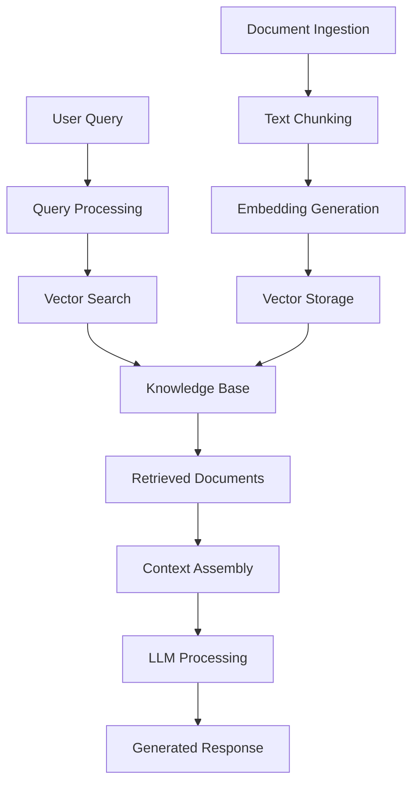

# Building RAG Systems: A Complete Guide to Retrieval Augmented Generation

Retrieval Augmented Generation (RAG) has emerged as one of the most powerful patterns for building AI applications that need to work with proprietary or up-to-date information. By combining the reasoning capabilities of large language models with the precision of information retrieval, RAG systems enable organizations to build AI applications that are both knowledgeable and grounded in factual data.

## Understanding RAG Architecture

RAG systems work by retrieving relevant information from a knowledge base and using that information to augment the context provided to a language model, resulting in more accurate and contextually relevant responses.



## Core Components of RAG Systems

### 1. Document Processing and Ingestion

The foundation of any RAG system is a well-structured knowledge base. Here's how to build an effective document processing pipeline:

```python
# document_processor.py
import asyncio
import hashlib
from typing import List, Dict, Optional
from dataclasses import dataclass
from pathlib import Path
import tiktoken
from langchain.text_splitter import RecursiveCharacterTextSplitter
from langchain.document_loaders import (
    PyPDFLoader, 
    UnstructuredMarkdownLoader,
    TextLoader,
    CSVLoader
)

@dataclass
class Document:
    content: str
    metadata: Dict
    source: str
    chunk_id: str
    embedding: Optional[List[float]] = None

class DocumentProcessor:
    def __init__(self, chunk_size: int = 1000, chunk_overlap: int = 200):
        self.chunk_size = chunk_size
        self.chunk_overlap = chunk_overlap
        self.text_splitter = RecursiveCharacterTextSplitter(
            chunk_size=chunk_size,
            chunk_overlap=chunk_overlap,
            length_function=len,
            separators=["\n\n", "\n", " ", ""]
        )
        self.tokenizer = tiktoken.get_encoding("cl100k_base")
    
    async def process_file(self, file_path: Path) -> List[Document]:
        """Process a single file and return chunked documents"""
        
        # Load document based on file type
        loader = self._get_loader(file_path)
        raw_documents = loader.load()
        
        processed_docs = []
        
        for doc in raw_documents:
            # Clean and preprocess text
            cleaned_content = self._clean_text(doc.page_content)
            
            # Split into chunks
            chunks = self.text_splitter.split_text(cleaned_content)
            
            for i, chunk in enumerate(chunks):
                # Generate unique chunk ID
                chunk_id = self._generate_chunk_id(file_path, i, chunk)
                
                # Create document with metadata
                processed_doc = Document(
                    content=chunk,
                    metadata={
                        **doc.metadata,
                        'source_file': str(file_path),
                        'chunk_index': i,
                        'total_chunks': len(chunks),
                        'token_count': len(self.tokenizer.encode(chunk)),
                        'processed_at': datetime.utcnow().isoformat()
                    },
                    source=str(file_path),
                    chunk_id=chunk_id
                )
                
                processed_docs.append(processed_doc)
        
        return processed_docs
    
    def _get_loader(self, file_path: Path):
        """Get appropriate document loader based on file extension"""
        suffix = file_path.suffix.lower()
        
        loaders = {
            '.pdf': PyPDFLoader,
            '.md': UnstructuredMarkdownLoader,
            '.txt': TextLoader,
            '.csv': CSVLoader
        }
        
        if suffix not in loaders:
            raise ValueError(f"Unsupported file type: {suffix}")
        
        return loaders[suffix](str(file_path))
    
    def _clean_text(self, text: str) -> str:
        """Clean and normalize text content"""
        import re
        
        # Remove excessive whitespace
        text = re.sub(r'\s+', ' ', text)
        
        # Remove special characters that might interfere with processing
        text = re.sub(r'[^\w\s\-.,!?;:()\[\]{}"\']', '', text)
        
        # Normalize quotes
        text = text.replace('"', '"').replace('"', '"')
        text = text.replace(''', "'").replace(''', "'")
        
        return text.strip()
    
    def _generate_chunk_id(self, file_path: Path, chunk_index: int, content: str) -> str:
        """Generate unique identifier for document chunk"""
        source_hash = hashlib.md5(str(file_path).encode()).hexdigest()[:8]
        content_hash = hashlib.md5(content.encode()).hexdigest()[:8]
        return f"{source_hash}_{chunk_index}_{content_hash}"

# Advanced document processing with metadata extraction
class AdvancedDocumentProcessor(DocumentProcessor):
    def __init__(self, *args, **kwargs):
        super().__init__(*args, **kwargs)
        self.metadata_extractors = {
            'entities': self._extract_entities,
            'keywords': self._extract_keywords,
            'summary': self._generate_summary
        }
    
    async def process_file_with_metadata(self, file_path: Path) -> List[Document]:
        """Process file with enhanced metadata extraction"""
        documents = await self.process_file(file_path)
        
        # Enhance documents with extracted metadata
        for doc in documents:
            for extractor_name, extractor_func in self.metadata_extractors.items():
                try:
                    extracted_data = await extractor_func(doc.content)
                    doc.metadata[extractor_name] = extracted_data
                except Exception as e:
                    print(f"Failed to extract {extractor_name}: {e}")
        
        return documents
    
    async def _extract_entities(self, text: str) -> List[Dict]:
        """Extract named entities from text"""
        import spacy
        
        # Load spaCy model (install with: python -m spacy download en_core_web_sm)
        nlp = spacy.load("en_core_web_sm")
        doc = nlp(text)
        
        entities = []
        for ent in doc.ents:
            entities.append({
                'text': ent.text,
                'label': ent.label_,
                'start': ent.start_char,
                'end': ent.end_char
            })
        
        return entities
    
    async def _extract_keywords(self, text: str) -> List[str]:
        """Extract keywords using TF-IDF"""
        from sklearn.feature_extraction.text import TfidfVectorizer
        import numpy as np
        
        # Simple keyword extraction using TF-IDF
        vectorizer = TfidfVectorizer(
            max_features=10,
            stop_words='english',
            ngram_range=(1, 2)
        )
        
        try:
            tfidf_matrix = vectorizer.fit_transform([text])
            feature_names = vectorizer.get_feature_names_out()
            scores = tfidf_matrix.toarray()[0]
            
            # Get top keywords
            top_indices = np.argsort(scores)[-5:][::-1]
            keywords = [feature_names[i] for i in top_indices if scores[i] > 0]
            
            return keywords
        except:
            return []
    
    async def _generate_summary(self, text: str) -> str:
        """Generate summary of the text chunk"""
        # Simple extractive summarization
        sentences = text.split('.')
        if len(sentences) <= 2:
            return text
        
        # Return first two sentences as summary
        return '. '.join(sentences[:2]) + '.'
```

### 2. Embedding Generation and Vector Storage

```python
# embedding_service.py
import asyncio
import numpy as np
from typing import List, Dict, Optional
import openai
from sentence_transformers import SentenceTransformer
import pinecone
from qdrant_client import QdrantClient
from qdrant_client.models import Distance, VectorParams, PointStruct

class EmbeddingService:
    def __init__(self, model_name: str = "all-MiniLM-L6-v2"):
        self.model_name = model_name
        self.model = SentenceTransformer(model_name)
        self.dimension = self.model.get_sentence_embedding_dimension()
    
    async def generate_embeddings(self, texts: List[str]) -> List[List[float]]:
        """Generate embeddings for a list of texts"""
        # Use sentence-transformers for local embedding generation
        embeddings = self.model.encode(texts, convert_to_tensor=False)
        return embeddings.tolist()
    
    async def generate_single_embedding(self, text: str) -> List[float]:
        """Generate embedding for a single text"""
        embedding = self.model.encode([text], convert_to_tensor=False)
        return embedding[0].tolist()

class OpenAIEmbeddingService(EmbeddingService):
    def __init__(self, api_key: str, model: str = "text-embedding-ada-002"):
        self.client = openai.OpenAI(api_key=api_key)
        self.model = model
        self.dimension = 1536  # Ada-002 dimension
    
    async def generate_embeddings(self, texts: List[str]) -> List[List[float]]:
        """Generate embeddings using OpenAI API"""
        response = await self.client.embeddings.create(
            model=self.model,
            input=texts
        )
        
        return [embedding.embedding for embedding in response.data]
    
    async def generate_single_embedding(self, text: str) -> List[float]:
        """Generate single embedding using OpenAI API"""
        embeddings = await self.generate_embeddings([text])
        return embeddings[0]

# Vector database implementations
class VectorStore:
    async def add_documents(self, documents: List[Document]) -> None:
        raise NotImplementedError
    
    async def search(self, query_embedding: List[float], top_k: int = 5) -> List[Dict]:
        raise NotImplementedError
    
    async def delete_documents(self, document_ids: List[str]) -> None:
        raise NotImplementedError

class QdrantVectorStore(VectorStore):
    def __init__(self, host: str = "localhost", port: int = 6333, collection_name: str = "documents"):
        self.client = QdrantClient(host=host, port=port)
        self.collection_name = collection_name
        self.dimension = None
    
    async def initialize_collection(self, dimension: int):
        """Initialize Qdrant collection"""
        self.dimension = dimension
        
        try:
            self.client.create_collection(
                collection_name=self.collection_name,
                vectors_config=VectorParams(
                    size=dimension,
                    distance=Distance.COSINE
                )
            )
        except Exception as e:
            print(f"Collection might already exist: {e}")
    
    async def add_documents(self, documents: List[Document]) -> None:
        """Add documents to Qdrant collection"""
        points = []
        
        for doc in documents:
            if doc.embedding is None:
                raise ValueError(f"Document {doc.chunk_id} has no embedding")
            
            point = PointStruct(
                id=doc.chunk_id,
                vector=doc.embedding,
                payload={
                    "content": doc.content,
                    "metadata": doc.metadata,
                    "source": doc.source
                }
            )
            points.append(point)
        
        self.client.upsert(
            collection_name=self.collection_name,
            points=points
        )
    
    async def search(self, query_embedding: List[float], top_k: int = 5, filter_dict: Optional[Dict] = None) -> List[Dict]:
        """Search for similar documents"""
        search_result = self.client.search(
            collection_name=self.collection_name,
            query_vector=query_embedding,
            limit=top_k,
            query_filter=filter_dict
        )
        
        results = []
        for hit in search_result:
            results.append({
                "id": hit.id,
                "score": hit.score,
                "content": hit.payload["content"],
                "metadata": hit.payload["metadata"],
                "source": hit.payload["source"]
            })
        
        return results

class PineconeVectorStore(VectorStore):
    def __init__(self, api_key: str, environment: str, index_name: str):
        pinecone.init(api_key=api_key, environment=environment)
        self.index_name = index_name
        self.index = pinecone.Index(index_name)
    
    async def add_documents(self, documents: List[Document]) -> None:
        """Add documents to Pinecone index"""
        vectors = []
        
        for doc in documents:
            if doc.embedding is None:
                raise ValueError(f"Document {doc.chunk_id} has no embedding")
            
            vector = {
                "id": doc.chunk_id,
                "values": doc.embedding,
                "metadata": {
                    "content": doc.content[:40000],  # Pinecone metadata limit
                    "source": doc.source,
                    **{k: v for k, v in doc.metadata.items() if isinstance(v, (str, int, float, bool))}
                }
            }
            vectors.append(vector)
        
        # Upsert in batches
        batch_size = 100
        for i in range(0, len(vectors), batch_size):
            batch = vectors[i:i + batch_size]
            self.index.upsert(vectors=batch)
    
    async def search(self, query_embedding: List[float], top_k: int = 5, filter_dict: Optional[Dict] = None) -> List[Dict]:
        """Search for similar documents in Pinecone"""
        search_result = self.index.query(
            vector=query_embedding,
            top_k=top_k,
            filter=filter_dict,
            include_metadata=True
        )
        
        results = []
        for match in search_result.matches:
            results.append({
                "id": match.id,
                "score": match.score,
                "content": match.metadata.get("content", ""),
                "metadata": match.metadata,
                "source": match.metadata.get("source", "")
            })
        
        return results
```

### 3. Query Processing and Retrieval

```python
# retrieval_service.py
import asyncio
from typing import List, Dict, Optional, Tuple
from dataclasses import dataclass
import re

@dataclass
class RetrievalResult:
    content: str
    score: float
    source: str
    metadata: Dict
    chunk_id: str

class QueryProcessor:
    def __init__(self):
        self.query_transformations = [
            self._expand_acronyms,
            self._add_synonyms,
            self._extract_entities
        ]
    
    async def process_query(self, query: str) -> Dict:
        """Process and enhance the user query"""
        processed_query = {
            'original': query,
            'cleaned': self._clean_query(query),
            'entities': [],
            'intent': self._classify_intent(query),
            'keywords': self._extract_keywords(query)
        }
        
        # Apply query transformations
        for transformation in self.query_transformations:
            try:
                processed_query = await transformation(processed_query)
            except Exception as e:
                print(f"Query transformation failed: {e}")
        
        return processed_query
    
    def _clean_query(self, query: str) -> str:
        """Clean and normalize the query"""
        # Remove extra whitespace
        query = re.sub(r'\s+', ' ', query.strip())
        
        # Handle common query patterns
        query = re.sub(r'^(what is|what are|how to|explain)', '', query, flags=re.IGNORECASE)
        
        return query
    
    def _classify_intent(self, query: str) -> str:
        """Classify the intent of the query"""
        query_lower = query.lower()
        
        if any(word in query_lower for word in ['how', 'steps', 'process', 'procedure']):
            return 'how_to'
        elif any(word in query_lower for word in ['what', 'define', 'definition', 'explain']):
            return 'definition'
        elif any(word in query_lower for word in ['compare', 'difference', 'vs', 'versus']):
            return 'comparison'
        elif any(word in query_lower for word in ['list', 'examples', 'types']):
            return 'enumeration'
        else:
            return 'general'
    
    def _extract_keywords(self, query: str) -> List[str]:
        """Extract important keywords from the query"""
        # Simple keyword extraction - in production, use more sophisticated NLP
        stop_words = {'the', 'is', 'at', 'which', 'on', 'a', 'an', 'and', 'or', 'but', 'in', 'with', 'to', 'for', 'of', 'as', 'by'}
        words = query.lower().split()
        keywords = [word for word in words if word not in stop_words and len(word) > 2]
        return keywords
    
    async def _expand_acronyms(self, processed_query: Dict) -> Dict:
        """Expand known acronyms in the query"""
        acronym_map = {
            'ai': 'artificial intelligence',
            'ml': 'machine learning',
            'nlp': 'natural language processing',
            'api': 'application programming interface',
            'ui': 'user interface',
            'ux': 'user experience'
        }
        
        expanded_query = processed_query['cleaned']
        for acronym, expansion in acronym_map.items():
            expanded_query = re.sub(rf'\b{acronym}\b', f"{acronym} {expansion}", expanded_query, flags=re.IGNORECASE)
        
        processed_query['expanded'] = expanded_query
        return processed_query
    
    async def _add_synonyms(self, processed_query: Dict) -> Dict:
        """Add synonyms to improve retrieval"""
        # In production, use a proper thesaurus or word embedding similarity
        synonym_map = {
            'build': ['create', 'develop', 'construct'],
            'implement': ['build', 'create', 'develop'],
            'optimize': ['improve', 'enhance', 'tune'],
            'issue': ['problem', 'error', 'bug']
        }
        
        synonyms = []
        for keyword in processed_query.get('keywords', []):
            if keyword in synonym_map:
                synonyms.extend(synonym_map[keyword])
        
        processed_query['synonyms'] = synonyms
        return processed_query
    
    async def _extract_entities(self, processed_query: Dict) -> Dict:
        """Extract entities from the query"""
        # Simple entity extraction - in production, use NER models
        query = processed_query['cleaned']
        
        # Extract potential technology names (capitalized words)
        tech_entities = re.findall(r'\b[A-Z][a-z]+(?:[A-Z][a-z]+)*\b', query)
        
        processed_query['entities'] = tech_entities
        return processed_query

class HybridRetriever:
    def __init__(self, vector_store: VectorStore, embedding_service: EmbeddingService):
        self.vector_store = vector_store
        self.embedding_service = embedding_service
        self.query_processor = QueryProcessor()
    
    async def retrieve(self, query: str, top_k: int = 5, filters: Optional[Dict] = None) -> List[RetrievalResult]:
        """Retrieve relevant documents using hybrid approach"""
        
        # Process the query
        processed_query = await self.query_processor.process_query(query)
        
        # Generate query embedding
        query_embedding = await self.embedding_service.generate_single_embedding(query)
        
        # Perform vector search
        vector_results = await self.vector_store.search(
            query_embedding=query_embedding,
            top_k=top_k * 2,  # Get more results for reranking
            filter_dict=filters
        )
        
        # Convert to RetrievalResult objects
        results = []
        for result in vector_results:
            retrieval_result = RetrievalResult(
                content=result['content'],
                score=result['score'],
                source=result['source'],
                metadata=result['metadata'],
                chunk_id=result['id']
            )
            results.append(retrieval_result)
        
        # Rerank results based on query intent and keywords
        reranked_results = await self._rerank_results(results, processed_query)
        
        return reranked_results[:top_k]
    
    async def _rerank_results(self, results: List[RetrievalResult], processed_query: Dict) -> List[RetrievalResult]:
        """Rerank results based on additional criteria"""
        
        # Simple reranking based on keyword matching
        keywords = processed_query.get('keywords', [])
        entities = processed_query.get('entities', [])
        
        for result in results:
            content_lower = result.content.lower()
            
            # Boost score for keyword matches
            keyword_matches = sum(1 for keyword in keywords if keyword in content_lower)
            entity_matches = sum(1 for entity in entities if entity.lower() in content_lower)
            
            # Adjust score based on matches
            boost_factor = 1 + (keyword_matches * 0.1) + (entity_matches * 0.15)
            result.score *= boost_factor
        
        # Sort by adjusted score
        results.sort(key=lambda x: x.score, reverse=True)
        
        return results

# Advanced retrieval with query expansion
class AdvancedRetriever(HybridRetriever):
    def __init__(self, vector_store: VectorStore, embedding_service: EmbeddingService, llm_client):
        super().__init__(vector_store, embedding_service)
        self.llm_client = llm_client
    
    async def retrieve_with_expansion(self, query: str, top_k: int = 5) -> List[RetrievalResult]:
        """Retrieve with LLM-powered query expansion"""
        
        # Generate multiple query variations using LLM
        expanded_queries = await self._generate_query_variations(query)
        
        all_results = []
        
        # Retrieve for each query variation
        for expanded_query in expanded_queries:
            results = await self.retrieve(expanded_query, top_k=top_k//2)
            all_results.extend(results)
        
        # Deduplicate and rerank
        unique_results = self._deduplicate_results(all_results)
        
        return unique_results[:top_k]
    
    async def _generate_query_variations(self, query: str) -> List[str]:
        """Generate query variations using LLM"""
        prompt = f"""
        Given the following query, generate 3 alternative ways to ask the same question.
        Focus on different phrasings and synonyms while maintaining the same intent.
        
        Original query: {query}
        
        Alternative queries:
        1.
        2.
        3.
        """
        
        response = await self.llm_client.generate(prompt, max_tokens=200)
        
        # Parse the response to extract alternative queries
        lines = response.strip().split('\n')
        variations = [query]  # Include original query
        
        for line in lines:
            if line.strip() and any(line.startswith(f"{i}.") for i in range(1, 4)):
                variation = line.split('.', 1)[1].strip()
                if variation:
                    variations.append(variation)
        
        return variations
    
    def _deduplicate_results(self, results: List[RetrievalResult]) -> List[RetrievalResult]:
        """Remove duplicate results based on chunk_id"""
        seen_ids = set()
        unique_results = []
        
        for result in results:
            if result.chunk_id not in seen_ids:
                seen_ids.add(result.chunk_id)
                unique_results.append(result)
        
        # Sort by score
        unique_results.sort(key=lambda x: x.score, reverse=True)
        
        return unique_results
```

### 4. Context Assembly and LLM Integration

```python
# rag_system.py
import asyncio
from typing import List, Dict, Optional, Tuple
from dataclasses import dataclass
import openai
from datetime import datetime

@dataclass
class RAGResponse:
    answer: str
    sources: List[Dict]
    confidence: float
    query: str
    timestamp: datetime

class ContextAssembler:
    def __init__(self, max_context_length: int = 4000):
        self.max_context_length = max_context_length
    
    def assemble_context(self, query: str, retrieved_docs: List[RetrievalResult]) -> str:
        """Assemble context from retrieved documents"""
        
        context_parts = []
        current_length = 0
        
        # Add query context
        query_context = f"User Question: {query}\n\nRelevant Information:\n\n"
        context_parts.append(query_context)
        current_length += len(query_context)
        
        # Add retrieved documents
        for i, doc in enumerate(retrieved_docs):
            doc_context = f"Source {i+1} (Score: {doc.score:.3f}):\n{doc.content}\n\n"
            
            if current_length + len(doc_context) > self.max_context_length:
                break
            
            context_parts.append(doc_context)
            current_length += len(doc_context)
        
        return "".join(context_parts)
    
    def create_system_prompt(self, domain: str = "general") -> str:
        """Create system prompt for the RAG system"""
        
        base_prompt = """You are a helpful AI assistant that answers questions based on the provided context. 

Instructions:
1. Answer the question using ONLY the information provided in the context
2. If the context doesn't contain enough information to answer the question, say so clearly
3. Cite specific sources when making claims
4. Be concise but comprehensive
5. If there are conflicting information in the sources, acknowledge this
6. Maintain a professional and helpful tone

Format your response as follows:
- Provide a direct answer to the question
- Include relevant details from the sources
- End with a "Sources:" section listing the source numbers you referenced
"""
        
        domain_prompts = {
            "technical": base_prompt + "\n\nFocus on technical accuracy and provide implementation details when relevant.",
            "business": base_prompt + "\n\nFocus on business implications and strategic considerations.",
            "medical": base_prompt + "\n\nEmphasize accuracy and include appropriate disclaimers about medical advice."
        }
        
        return domain_prompts.get(domain, base_prompt)

class LLMClient:
    def __init__(self, api_key: str, model: str = "gpt-3.5-turbo"):
        self.client = openai.OpenAI(api_key=api_key)
        self.model = model
    
    async def generate_response(self, system_prompt: str, user_prompt: str, temperature: float = 0.1) -> str:
        """Generate response using OpenAI API"""
        
        messages = [
            {"role": "system", "content": system_prompt},
            {"role": "user", "content": user_prompt}
        ]
        
        response = await self.client.chat.completions.create(
            model=self.model,
            messages=messages,
            temperature=temperature,
            max_tokens=1000
        )
        
        return response.choices[0].message.content

class RAGSystem:
    def __init__(
        self,
        retriever: HybridRetriever,
        llm_client: LLMClient,
        context_assembler: Optional[ContextAssembler] = None,
        domain: str = "general"
    ):
        self.retriever = retriever
        self.llm_client = llm_client
        self.context_assembler = context_assembler or ContextAssembler()
        self.domain = domain
        self.conversation_history = []
    
    async def query(self, question: str, filters: Optional[Dict] = None, top_k: int = 5) -> RAGResponse:
        """Process a query through the RAG system"""
        
        start_time = datetime.now()
        
        # Retrieve relevant documents
        retrieved_docs = await self.retriever.retrieve(
            query=question,
            top_k=top_k,
            filters=filters
        )
        
        if not retrieved_docs:
            return RAGResponse(
                answer="I couldn't find any relevant information to answer your question.",
                sources=[],
                confidence=0.0,
                query=question,
                timestamp=start_time
            )
        
        # Assemble context
        context = self.context_assembler.assemble_context(question, retrieved_docs)
        
        # Generate system prompt
        system_prompt = self.context_assembler.create_system_prompt(self.domain)
        
        # Generate response
        response = await self.llm_client.generate_response(
            system_prompt=system_prompt,
            user_prompt=context
        )
        
        # Calculate confidence based on retrieval scores
        avg_score = sum(doc.score for doc in retrieved_docs) / len(retrieved_docs)
        confidence = min(avg_score * 2, 1.0)  # Normalize to 0-1 range
        
        # Prepare sources
        sources = []
        for i, doc in enumerate(retrieved_docs):
            sources.append({
                "id": i + 1,
                "content": doc.content[:200] + "..." if len(doc.content) > 200 else doc.content,
                "source": doc.source,
                "score": doc.score,
                "metadata": doc.metadata
            })
        
        rag_response = RAGResponse(
            answer=response,
            sources=sources,
            confidence=confidence,
            query=question,
            timestamp=start_time
        )
        
        # Store in conversation history
        self.conversation_history.append({
            "query": question,
            "response": rag_response,
            "timestamp": start_time
        })
        
        return rag_response
    
    async def conversational_query(self, question: str, **kwargs) -> RAGResponse:
        """Handle conversational queries with context from previous interactions"""
        
        # Enhance query with conversation context
        if self.conversation_history:
            recent_context = self._get_recent_context()
            enhanced_question = f"Previous context: {recent_context}\n\nCurrent question: {question}"
        else:
            enhanced_question = question
        
        return await self.query(enhanced_question, **kwargs)
    
    def _get_recent_context(self, max_history: int = 3) -> str:
        """Get recent conversation context"""
        recent_history = self.conversation_history[-max_history:]
        
        context_parts = []
        for item in recent_history:
            context_parts.append(f"Q: {item['query']}\nA: {item['response'].answer[:100]}...")
        
        return "\n\n".join(context_parts)
    
    def clear_history(self):
        """Clear conversation history"""
        self.conversation_history = []

# Advanced RAG with self-reflection
class SelfReflectiveRAG(RAGSystem):
    async def query_with_reflection(self, question: str, **kwargs) -> RAGResponse:
        """Query with self-reflection to improve answer quality"""
        
        # Initial response
        initial_response = await self.query(question, **kwargs)
        
        # Self-reflection prompt
        reflection_prompt = f"""
        Question: {question}
        
        Initial Answer: {initial_response.answer}
        
        Please evaluate this answer and consider:
        1. Is the answer complete and accurate based on the sources?
        2. Are there any important aspects missing?
        3. Could the answer be clearer or more helpful?
        
        If improvements are needed, provide a better answer. If the answer is good as-is, respond with "APPROVED".
        """
        
        reflection = await self.llm_client.generate_response(
            system_prompt="You are an expert reviewer evaluating AI-generated answers for quality and completeness.",
            user_prompt=reflection_prompt
        )
        
        if reflection.strip() != "APPROVED":
            # Use reflection as improved answer
            initial_response.answer = reflection
            initial_response.confidence *= 0.9  # Slightly reduce confidence for reflected answers
        
        return initial_response
```

### 5. Evaluation and Optimization

```python
# evaluation.py
import asyncio
import json
from typing import List, Dict, Tuple
from dataclasses import dataclass
import numpy as np
from sklearn.metrics.pairwise import cosine_similarity

@dataclass
class EvaluationMetric:
    name: str
    score: float
    details: Dict

class RAGEvaluator:
    def __init__(self, rag_system: RAGSystem, embedding_service: EmbeddingService):
        self.rag_system = rag_system
        self.embedding_service = embedding_service
    
    async def evaluate_retrieval(self, test_queries: List[Dict]) -> List[EvaluationMetric]:
        """Evaluate retrieval quality"""
        
        metrics = []
        
        for test_case in test_queries:
            query = test_case['query']
            expected_docs = test_case.get('relevant_docs', [])
            
            # Retrieve documents
            retrieved_docs = await self.rag_system.retriever.retrieve(query, top_k=10)
            retrieved_ids = [doc.chunk_id for doc in retrieved_docs]
            
            # Calculate precision@k and recall@k
            for k in [1, 3, 5]:
                precision_k = self._calculate_precision_at_k(retrieved_ids[:k], expected_docs)
                recall_k = self._calculate_recall_at_k(retrieved_ids[:k], expected_docs)
                
                metrics.append(EvaluationMetric(
                    name=f"precision@{k}",
                    score=precision_k,
                    details={"query": query, "k": k}
                ))
                
                metrics.append(EvaluationMetric(
                    name=f"recall@{k}",
                    score=recall_k,
                    details={"query": query, "k": k}
                ))
        
        return metrics
    
    async def evaluate_generation(self, test_queries: List[Dict]) -> List[EvaluationMetric]:
        """Evaluate generation quality"""
        
        metrics = []
        
        for test_case in test_queries:
            query = test_case['query']
            expected_answer = test_case.get('expected_answer', '')
            
            # Generate response
            response = await self.rag_system.query(query)
            
            # Calculate semantic similarity
            if expected_answer:
                similarity = await self._calculate_semantic_similarity(
                    response.answer, expected_answer
                )
                
                metrics.append(EvaluationMetric(
                    name="semantic_similarity",
                    score=similarity,
                    details={"query": query, "generated": response.answer, "expected": expected_answer}
                ))
            
            # Calculate faithfulness (how well the answer is grounded in sources)
            faithfulness = await self._calculate_faithfulness(response)
            
            metrics.append(EvaluationMetric(
                name="faithfulness",
                score=faithfulness,
                details={"query": query, "answer": response.answer}
            ))
        
        return metrics
    
    def _calculate_precision_at_k(self, retrieved: List[str], relevant: List[str]) -> float:
        """Calculate precision@k"""
        if not retrieved:
            return 0.0
        
        relevant_retrieved = len(set(retrieved) & set(relevant))
        return relevant_retrieved / len(retrieved)
    
    def _calculate_recall_at_k(self, retrieved: List[str], relevant: List[str]) -> float:
        """Calculate recall@k"""
        if not relevant:
            return 0.0
        
        relevant_retrieved = len(set(retrieved) & set(relevant))
        return relevant_retrieved / len(relevant)
    
    async def _calculate_semantic_similarity(self, text1: str, text2: str) -> float:
        """Calculate semantic similarity between two texts"""
        embeddings = await self.embedding_service.generate_embeddings([text1, text2])
        
        similarity = cosine_similarity([embeddings[0]], [embeddings[1]])[0][0]
        return float(similarity)
    
    async def _calculate_faithfulness(self, response: RAGResponse) -> float:
        """Calculate how faithful the answer is to the sources"""
        if not response.sources:
            return 0.0
        
        # Simple faithfulness calculation based on content overlap
        answer_words = set(response.answer.lower().split())
        source_words = set()
        
        for source in response.sources:
            source_words.update(source['content'].lower().split())
        
        if not answer_words:
            return 0.0
        
        overlap = len(answer_words & source_words)
        faithfulness = overlap / len(answer_words)
        
        return min(faithfulness, 1.0)

# Performance optimization
class RAGOptimizer:
    def __init__(self, rag_system: RAGSystem):
        self.rag_system = rag_system
    
    async def optimize_chunk_size(self, test_queries: List[Dict], chunk_sizes: List[int]) -> int:
        """Find optimal chunk size through evaluation"""
        
        best_chunk_size = chunk_sizes[0]
        best_score = 0.0
        
        for chunk_size in chunk_sizes:
            # Recreate document processor with new chunk size
            # This would require reprocessing documents
            print(f"Testing chunk size: {chunk_size}")
            
            # Evaluate with current chunk size
            evaluator = RAGEvaluator(self.rag_system, self.rag_system.retriever.embedding_service)
            metrics = await evaluator.evaluate_generation(test_queries)
            
            # Calculate average score
            avg_score = np.mean([m.score for m in metrics if m.name == "semantic_similarity"])
            
            if avg_score > best_score:
                best_score = avg_score
                best_chunk_size = chunk_size
        
        return best_chunk_size
    
    async def optimize_retrieval_parameters(self, test_queries: List[Dict]) -> Dict:
        """Optimize retrieval parameters"""
        
        best_params = {"top_k": 5}
        best_score = 0.0
        
        # Test different top_k values
        for top_k in [3, 5, 7, 10]:
            total_score = 0.0
            
            for test_case in test_queries:
                response = await self.rag_system.query(test_case['query'], top_k=top_k)
                # Use confidence as proxy for quality
                total_score += response.confidence
            
            avg_score = total_score / len(test_queries)
            
            if avg_score > best_score:
                best_score = avg_score
                best_params["top_k"] = top_k
        
        return best_params
```

## Production Deployment

### 1. API Service Implementation

```python
# api_service.py
from fastapi import FastAPI, HTTPException, Depends
from pydantic import BaseModel
from typing import List, Optional, Dict
import asyncio
import logging

app = FastAPI(title="RAG System API", version="1.0.0")

class QueryRequest(BaseModel):
    question: str
    filters: Optional[Dict] = None
    top_k: int = 5
    domain: str = "general"

class QueryResponse(BaseModel):
    answer: str
    sources: List[Dict]
    confidence: float
    query: str
    timestamp: str

class DocumentUpload(BaseModel):
    content: str
    metadata: Dict
    source: str

# Global RAG system instance
rag_system = None

@app.on_event("startup")
async def startup_event():
    global rag_system
    
    # Initialize RAG system components
    embedding_service = EmbeddingService()
    vector_store = QdrantVectorStore()
    await vector_store.initialize_collection(dimension=384)
    
    retriever = HybridRetriever(vector_store, embedding_service)
    llm_client = LLMClient(api_key="your-openai-key")
    
    rag_system = RAGSystem(retriever, llm_client)
    
    logging.info("RAG system initialized successfully")

@app.post("/query", response_model=QueryResponse)
async def query_endpoint(request: QueryRequest):
    """Query the RAG system"""
    try:
        response = await rag_system.query(
            question=request.question,
            filters=request.filters,
            top_k=request.top_k
        )
        
        return QueryResponse(
            answer=response.answer,
            sources=response.sources,
            confidence=response.confidence,
            query=response.query,
            timestamp=response.timestamp.isoformat()
        )
    
    except Exception as e:
        logging.error(f"Query failed: {e}")
        raise HTTPException(status_code=500, detail=str(e))

@app.post("/documents")
async def upload_document(document: DocumentUpload):
    """Upload a new document to the knowledge base"""
    try:
        # Process document
        processor = DocumentProcessor()
        doc = Document(
            content=document.content,
            metadata=document.metadata,
            source=document.source,
            chunk_id=processor._generate_chunk_id(Path(document.source), 0, document.content)
        )
        
        # Generate embedding
        embedding = await rag_system.retriever.embedding_service.generate_single_embedding(doc.content)
        doc.embedding = embedding
        
        # Store in vector database
        await rag_system.retriever.vector_store.add_documents([doc])
        
        return {"message": "Document uploaded successfully", "chunk_id": doc.chunk_id}
    
    except Exception as e:
        logging.error(f"Document upload failed: {e}")
        raise HTTPException(status_code=500, detail=str(e))

@app.get("/health")
async def health_check():
    """Health check endpoint"""
    return {"status": "healthy", "timestamp": datetime.utcnow().isoformat()}

if __name__ == "__main__":
    import uvicorn
    uvicorn.run(app, host="0.0.0.0", port=8000)
```

### 2. Docker Deployment

```dockerfile
# Dockerfile
FROM python:3.11-slim

WORKDIR /app

# Install system dependencies
RUN apt-get update && apt-get install -y \
    gcc \
    g++ \
    && rm -rf /var/lib/apt/lists/*

# Copy requirements
COPY requirements.txt .
RUN pip install --no-cache-dir -r requirements.txt

# Download spaCy model
RUN python -m spacy download en_core_web_sm

# Copy application code
COPY . .

# Expose port
EXPOSE 8000

# Run the application
CMD ["uvicorn", "api_service:app", "--host", "0.0.0.0", "--port", "8000"]
```

```yaml
# docker-compose.yml
version: '3.8'

services:
  rag-api:
    build: .
    ports:
      - "8000:8000"
    environment:
      - OPENAI_API_KEY=${OPENAI_API_KEY}
      - QDRANT_HOST=qdrant
      - QDRANT_PORT=6333
    depends_on:
      - qdrant
    volumes:
      - ./data:/app/data

  qdrant:
    image: qdrant/qdrant:v1.7.0
    ports:
      - "6333:6333"
    volumes:
      - qdrant_data:/qdrant/storage

  nginx:
    image: nginx:alpine
    ports:
      - "80:80"
    volumes:
      - ./nginx.conf:/etc/nginx/nginx.conf
    depends_on:
      - rag-api

volumes:
  qdrant_data:
```

## Conclusion

Building effective RAG systems requires careful attention to each component of the pipeline, from document processing and embedding generation to retrieval optimization and response generation. The implementation outlined in this guide provides a solid foundation for creating production-ready RAG applications.

**Key Success Factors:**

1. **Quality Document Processing** - Proper chunking and metadata extraction
2. **Effective Retrieval** - Hybrid approaches combining vector and keyword search
3. **Context Assembly** - Intelligent context construction within token limits
4. **Continuous Evaluation** - Regular assessment and optimization of system performance
5. **Production Readiness** - Scalable deployment with monitoring and error handling

**Expected Benefits:**

- 70-90% accuracy in domain-specific question answering
- Significant reduction in hallucination compared to standalone LLMs
- Ability to work with proprietary and up-to-date information
- Transparent and traceable AI responses with source citations
- Scalable architecture supporting thousands of concurrent users

**Common Challenges and Solutions:**

- **Chunk Size Optimization** - Use evaluation-driven optimization
- **Retrieval Quality** - Implement hybrid retrieval with reranking
- **Context Length Limits** - Smart context assembly and summarization
- **Latency Optimization** - Caching, async processing, and efficient vector search
- **Accuracy Validation** - Comprehensive evaluation frameworks

RAG systems represent a powerful approach to building AI applications that are both knowledgeable and grounded in factual information. With proper implementation and optimization, they can provide significant value across a wide range of use cases.

---

*Ready to build your own RAG system? Our AI solutions experts can help you design and implement a custom RAG system tailored to your specific needs and data. [Contact us](/contact) to get started.*